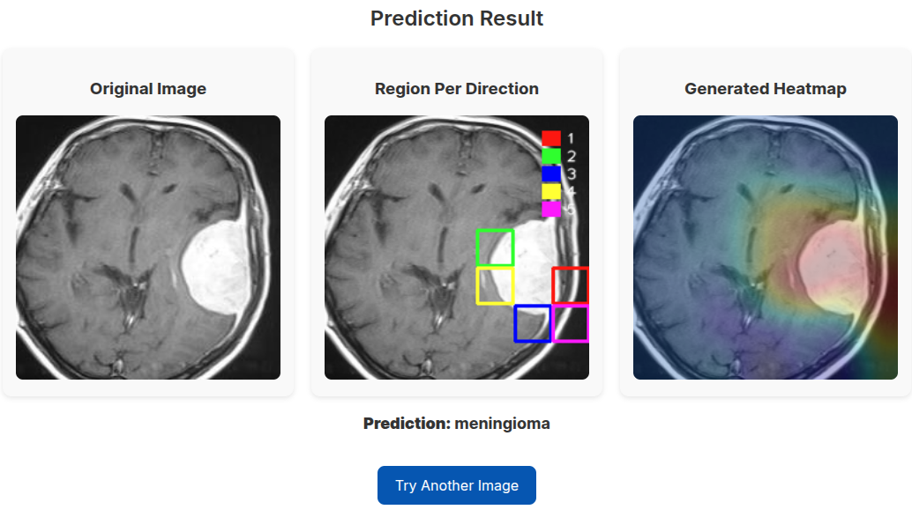

# Brain Tumor Classifier

This is a web application built using **Flask** for the diagnosis of brain tumors using Magnetic Resonance Imaging (MRI) (using **AChorDS-LVQ**). It has been trained on the [Brain Tumor MRI Dataset](https://www.kaggle.com/datasets/masoudnickparvar/brain-tumor-mri-dataset), containing four types of brain tumors: glioma - meningioma - no tumor and pituitary. The app predicts what type of brain tumor is in an image. In addition to the prediction, it also visualizes a heatmap, capturing the effect of each pixels on the model decision (in a form of heatmap).

## Features

- **Prediction**: Classify the type of the brain tumor in the input image.
- **Visualization**: Displays the influence of pixels on the model's prediction.
- **User-friendly Interface**: Upload an image (or a url of an image), and receive immediate predictions and visualizations.
  
## Requirements

To run this app locally, make sure you have the following installed:

- **Python 3.x**
- **pip** (Python package installer)

### Dependencies

Install the necessary Python packages by running:

```bash
pip install -r requirements.txt
```


The requirements.txt file includes the necessary dependencies like Flask, Matplotlib, and other libraries required for the app.


### Model Preparation

To use the app, you need to put a trained model in a directory `models`. Follow these steps:


## Usage

1. Clone the repository to your local machine:

```bash
git clone https://github.com/yourusername/housing-eviction-predictor.git
cd housing-eviction-predictor
```
2. Install dependencies:

```bash
pip install -r requirements.txt
```

3. Run the Flask application:

```bash
python app.py
```

4. Open your browser and go to:

```arduino
http://127.0.0.1:5000/
```

5. Upload a text file with a legal case description, choose the number of influential words you'd like to display, and submit the form. The app will display the prediction and visualizations of the most influential words for each model.


## File Format

The input image should be a (.jpg) file. The app will process this image to predict what type of car is present in the image.

## Example

This is the visualization generated for an image:




## Contributing

Feel free to fork this project and make improvements! If you find bugs or have suggestions for new features, please open an issue or create a pull request.
 
## References

Please consider citing the following works:

Mohammadi, M., Ghosh, S., A prototype-based model for set classification‏. arXiv preprint arXiv:2408.13720.

Mohammadi, M., Babai, M., & Wilkinson, M. H. F. (2024). Generalized Relevance Learning Grassmann Quantization. IEEE Transactions on Pattern Analysis and Machine Intelligence (2024).

## License

This project is open-source and available under the MIT License.


